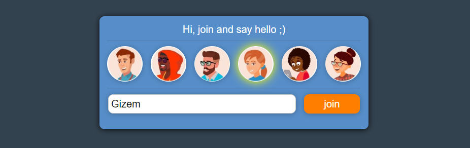

## Spring Boot - WebSocket - Kafka @Kubernetes Messaging Demo




## Requirements

1. Java - 1.8.x

2. Maven - 3.x.x

3. Docker - 19.03

4. Kubernetes - 1.14

## Steps to Setup

**1. Clone the repository**

```bash
git clone https://github.com/tcsgit/hello.git
```

**2. Deploy Kafka cluster on kubernetes using kubectl**

```bash
cd hello
kubectl apply -f kafka/
```

**3. Build the application using maven**

```bash
mvnw package
```

**4. Dockerize the application using maven**

```bash
mvnw dockerfile:build
```

**5. Deploy the application on kubernetes using kubectl or helm**

```bash
kubectl apply -f k8s-hello-deployment-version.yaml
helm install hello-release ./hello-chart
```

Optionally, you can use Jenkinsfile s to create CI/CD pipeline for OnPrem Kubernetes or Google GKE
